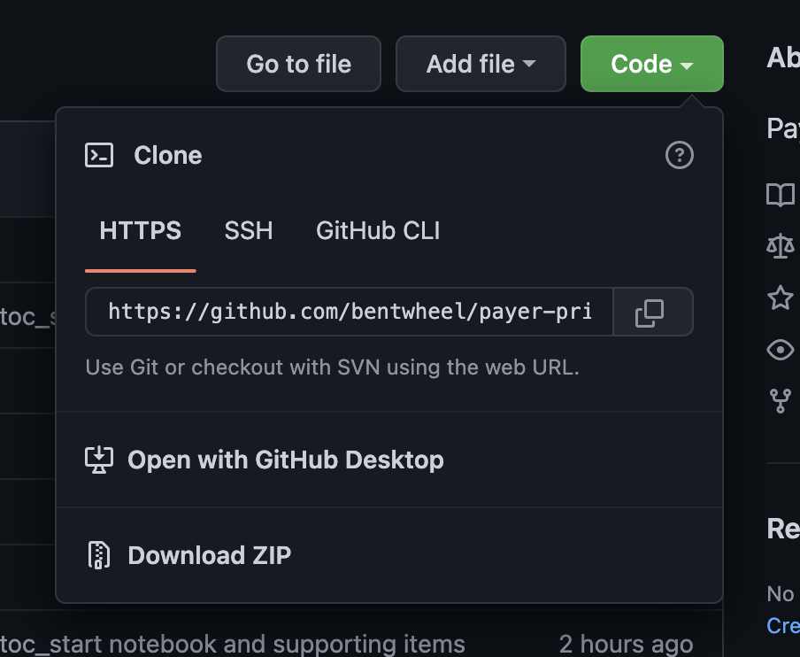

# How to Access Transparency in Coverage Data for Mere Mortals

July 1, 2022, the [Center for Medicare & Medicaid Services](https://www.cms.gov/) (CMS) began enforcing its new [Transparency in Coverage Rule](https://www.cms.gov/healthplan-price-transparency), which requires almost all US health plans to post very detailed pricing data about the vast majority of the services and procedures these plans cover.

In this Jupyter Notebook series, I will provide code and commentary that enables mere mortals like you and me to draw insights from the Transparency in Coverage datasets that payers have released. Some of this data is quite large - and that's no problem - we'll go through methods using the Open Source programming language [Python](https://www.python.org/) to efficiently crawl through these files and extract exactly what we need.

*(The targeted audience for this notebook series is actuaries who have some familiarity with the Python lagnuage, but you can probably also learn as you go if you've not seen it before.)*

# Getting Started

You need to have a way to run Jupyter Notebook files to use this tutorial. This means you can either find a JupyterHub site for which you have login credentials, or you can install Jupyter lab locally on your machine. Here are basic instructions to do the latter.

## Install Jupyter Notebook Locally

### Step One: Get Python

You probably already have Python on your machine. You can test that by entering the word `python` or `python3` on a MacOS command prompt, or entering the word `py` or `python` on a Windows command prompt. If the Python Interpreter starts up, you're in business! (You can type `quit()` to exit the Python interpreter, or just close the command prompt window altogether.)

##### MacOS
You need Python if you don't have it already. If you have a MacOS machine you should follow [these instructions](https://docs.python-guide.org/starting/install3/osx/), because `homebrew` is a game-changer, and it's a foolproof way to install Python 3 and `pip` (the Python Package Manager).

##### Windows
If you have Windows, you can obtain Python fromt the official Windows Store, or you can [download it from Python.org](https://www.python.org/downloads/windows/).

### Step Two: Get Jupyter
You need to do the things listed here:
[https://jupyter.org/install](https://jupyter.org/install)

### Step Three: Install Jupyter's git functionality with pip
At a command prompt, type `pip install --upgrade jupyterlab jupyterlab-git`. This will enable Git functionality within JupyterLab. If you have already launched JupyterLab, you will need to close the browser window it launched in, and restart it from the commandline as directed by the linked installation guide in Step Two, above.

### Step Four: Clone this repository in JupyterLab
First, you need to copy the URL for this repository by clicking on the green "Code" button above, selecting "HTTPS" and then copying the URL.

Then, you'll need to navigate to the Jupyter Lab git integration tab, and select Clone a repository. When prompted, enter the URL you copied from the Github site. All the notebooks part of this tutorial should appear and you can open the first notebook, `tic_start.ipynb`, to begin the tutorial.